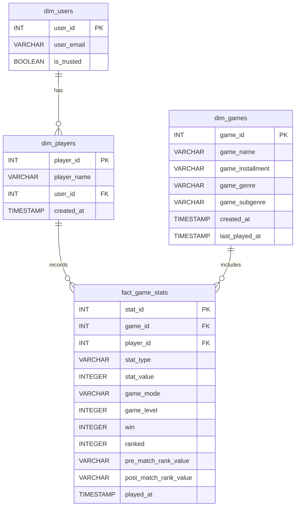

```mermaid
erDiagram
    dim_users {
        INT user_id PK
        VARCHAR user_email
        BOOLEAN is_trusted
    }

    dim_players {
        INT player_id PK
        VARCHAR player_name
        INT user_id FK
        TIMESTAMP created_at
    }

    dim_games {
        INT game_id PK
        VARCHAR game_name
        VARCHAR game_installment
        VARCHAR game_genre
        VARCHAR game_subgenre
        TIMESTAMP created_at
        TIMESTAMP last_played_at
    }

    fact_game_stats {
        INT stat_id PK
        INT game_id FK
        INT player_id FK
        VARCHAR stat_type
        INTEGER stat_value
        VARCHAR game_mode
        INTEGER game_level
        INTEGER win
        INTEGER ranked
        VARCHAR pre_match_rank_value
        VARCHAR post_match_rank_value
        TIMESTAMP played_at
    }

    dim_users ||--o{ dim_players : "has"
    dim_players ||--o{ fact_game_stats : "records"
    dim_games ||--o{ fact_game_stats : "includes"
```
