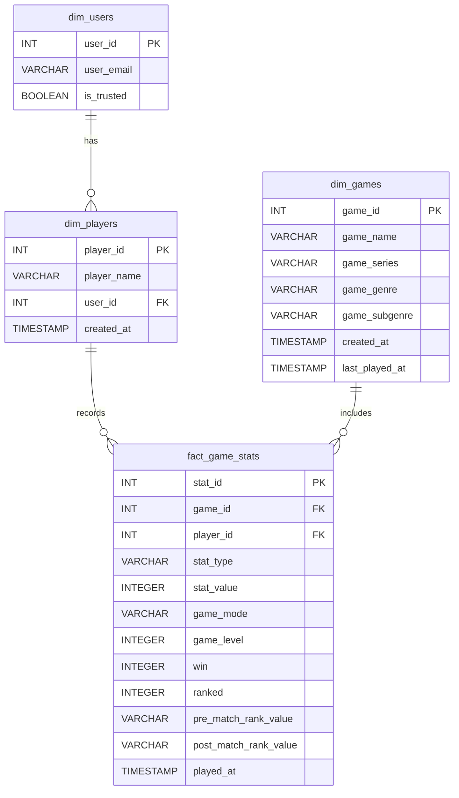

# 🎮 Video Game Stats Tracker (Full Stack)

A full-stack web application built to **log, track, and analyze video game statistics**.

This app uses:
- **Frontend:** Streamlit (Python)
- **Backend:** Flask API
- **Database:** AWS Redshift Serverless (star schema)

---

## 🚀 Live Application
🔗 [Video Game Stats Entry](https://video-game-stats-tracker.streamlit.app/)

---

## 🏩 Application Architecture

**Frontend (Streamlit):**
- Python web app deployed on Streamlit Community Cloud.
- Handles Google OAuth authentication (`st.login("google")`).
- Manages UI, user sessions, and API communication.

**Backend (Flask API):**
- Python API hosted on Render.
- Manages business logic, JWT-based authentication, and CRUD operations.

**Database (AWS Redshift Serverless):**
- Stores all analytical data in a **star schema** with `dim` and `fact` tables.

---

## 🔐 Authentication Flow

1. User logs in via **Google OAuth** using `st.login("google")`.
2. Streamlit receives the user email → checks if trusted.
3. If trusted → requests a **JWT** from Flask `/login`.
4. If not trusted → calls `/add_user` to register a guest user.
5. Flask issues a short-lived **JWT** with user role info.
6. Streamlit uses JWT for authenticated API calls (via `Authorization: Bearer <token>`).

---

## ✨ Key Features

- 🔑 **Google Authentication** (with JWT + API Key security)
- 🧩 **CRUD for Admins:**
  - Add/edit/delete players, games, and stats
- 🤮 **Star Schema Design** for analytics efficiency
- ⚡ **Fast Backend Connections** with psycopg2 connection pooling
- 🧠 **Smart UI:**
  - Hybrid inputs (dropdown + text)
  - Dependent dropdowns (Genre → Subgenre)
  - Safe multi-step delete confirmation

---

## 🏷 How to Run Locally

### Prerequisites
- Python 3.9+
- AWS Redshift Serverless database
- Google Cloud project with OAuth 2.0 credentials (`http://localhost:8501`)
- Separate `requirements.txt` files for backend and frontend

---

### 1️⃣ Backend (Flask)

```bash
cd /your-project-folder/backend

# requirements.txt
Flask
psycopg2-binary
PyJWT
gunicorn

# Install dependencies
pip install -r requirements.txt
```

Create a `.env` file (excluded via `.gitignore`):

```env
DB_URL=your-redshift-endpoint.amazonaws.com
DB_NAME=dev
DB_USER=admin
DB_PASSWORD=your-password
API_KEY=your-random-api-key
JWT_SECRET_KEY=your-random-secret
TRUSTED_EMAILS=user1@gmail.com,user2@gmail.com
```

Run the Flask app:
```bash
python flask_app.py
```
> Flask starts and creates tables automatically.

---

### 2️⃣ Frontend (Streamlit)

```bash
cd /your-project-folder/frontend

# requirements.txt
streamlit
requests
psycopg2-binary
pandas
sqlalchemy

# Install dependencies
pip install -r requirements.txt
```

Create Streamlit secrets in `.streamlit/secrets.toml`:

```toml
[flask]
flask_api_url = "http://127.0.0.1:5000/api"

[redshift]
database_url = "your-redshift-url.amazonaws.com"
database_name = "dev"
database_user = "admin"
database_password = "your-password"

[config]
api_key = "your-same-api-key-from-step-1"
trusted_emails = ["your-admin-email@gmail.com"]
```

Run Streamlit app:
```bash
streamlit run streamlit_app.py
```

---

## 🧱 Project Structure & New Pages

**`utils.py`** — Central utility module storing key functions, constants, and reusable variables for both backend and frontend logic.

**Home Page** — A welcoming landing page that introduces users to the application, its purpose, and navigation links.

**Stats Page** — Allows authenticated users to log, edit, and view video game statistics. Integrated with backend CRUD endpoints for dynamic updates.

**Privacy Policy Page** — Provides details about user data handling and security, required for **Google OAuth verification**.

**Terms of Service Page** — Outlines acceptable use, user responsibilities, and account management terms to comply with **Google API verification requirements**.

---

## 🧩 Entity Relationship Diagram (ERD)

### Mermaid Diagram (GitHub Rendered)



---

## 🗂 File Summary

- `README.md` → Project Overview & Setup
- `Data_Dictonary.md` → Database Schema Reference
- `ER_Diagram.md` → Entity-Relationship Diagram Reference

---

🔗 Don’t forget to check out my tutorials and live demos on YouTube:
- [The BOL Guide](https://www.youtube.com/@TheBOLGuide)
- [The BOL Broadcast](https://www.youtube.com/@TheBOLBroadcast)
